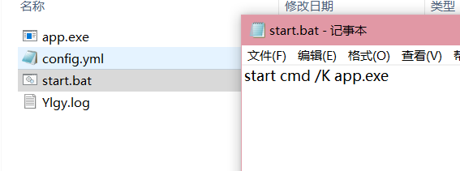

# Fxxk-ylgy
羊了个羊无限通关

## 声明

> 本项目仅供娱乐和学习使用，禁止使用本项目从事非法活动，如从事违法活动与作者无关。

## 开始使用
### 1. 抓包

> 抓取 `cat-match.easygame2021.com` 的请求包内 Header 为 `t` 的内容


#### IOS可以使用Stream抓取通信包

使用stream[抓包教程](https://cloud.tencent.com/developer/article/1842000)


### 2. 安装包
- 通过[Releases](https://github.com/Clov614/Fxxk-ylgy/releases)页面下载


### 3. 配置文件相关

> 第一次执行可执行文件会初始化在目录生成`config.yml`设置文件

#### 相关配置如下

```yaml
token: ""       #token为获取到的header中t值
cost_time: -1   #cost_time为完成耗时 单位s，默认-1随机表示随机生成1s~1h之内的随机数，设置为正数则为固定
cycle_count: 1  #需要通关的次数，最大支持10，默认1
```

### 4. 启动注意事项

windows操作系统下，推荐使用命令行,启动本脚本

```
start cmd /K app.exe
```


建议新建 `start.bat` 批处理文件

内容如下:

```
start cmd /K app.exe
```

